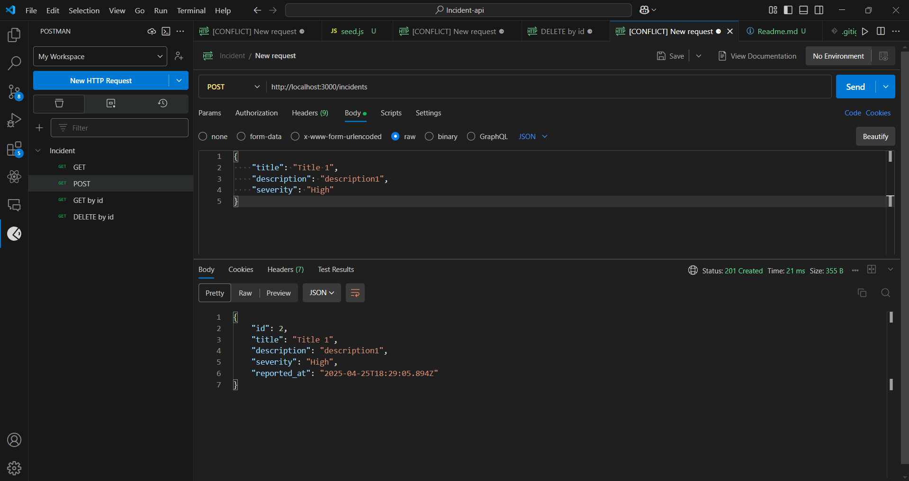
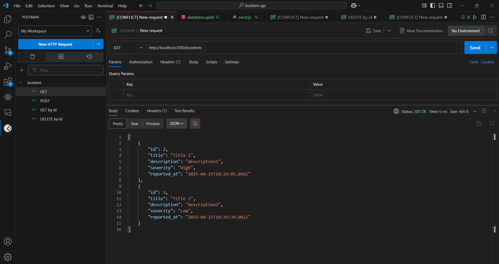
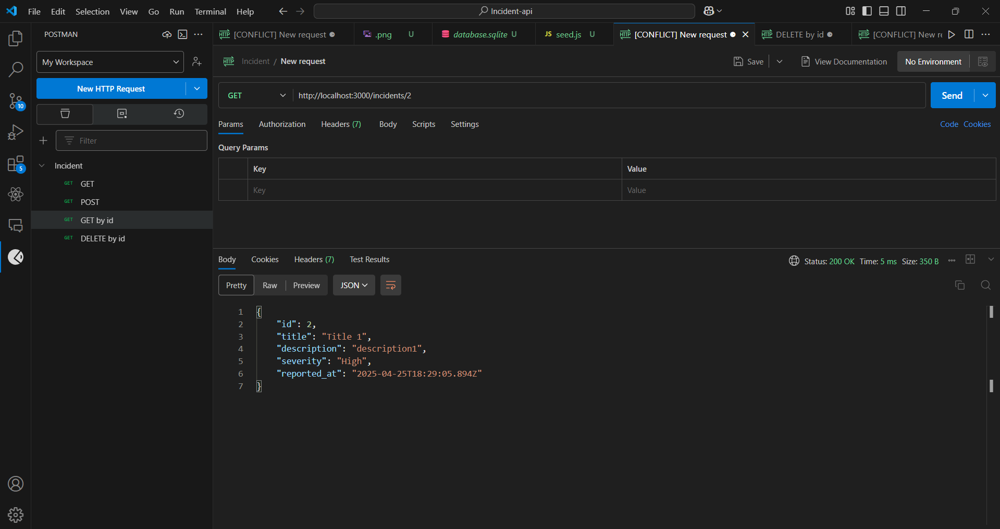
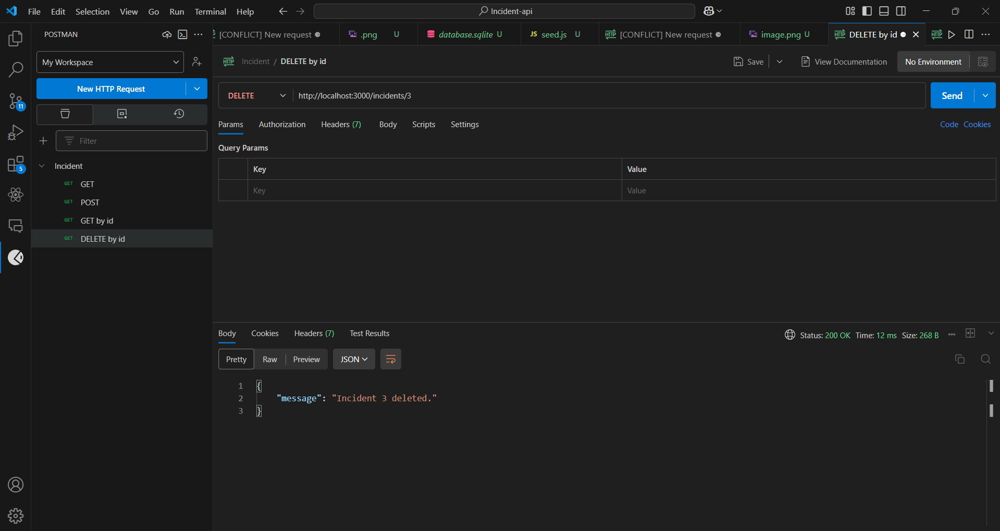

## Used Technologies

```
Framework: Express.js  
Database: SQLite  
```

## Clone the Repository

```bash
git clone https://github.com/digvijay3184/incident-api.git
cd incident-api
```

## Setup Guide

```bash
npm install          # Install dependencies
node seed.js         # Create the database and insert 2 sample records
node server.js       # Start the API server on http://localhost:3000
```

## API Endpoints

### GET /incidents
Returns all incidents.

### GET /incidents/:id  
Returns a single incident by ID.

### POST /incidents  
Logs a new incident.  
**Request Body (JSON):**
```json
{
  "title": "Sample Incident",
  "description": "This is a detailed description.",
  "severity": "High"
}
```

### DELETE /incidents/:id  
Deletes an incident by ID.

## Screenshots

### POST Incident


### GET All Incidents


### GET Incident by ID


### DELETE Incident

